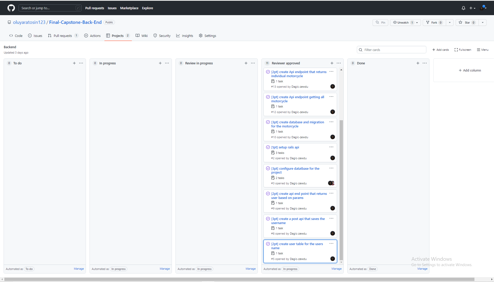
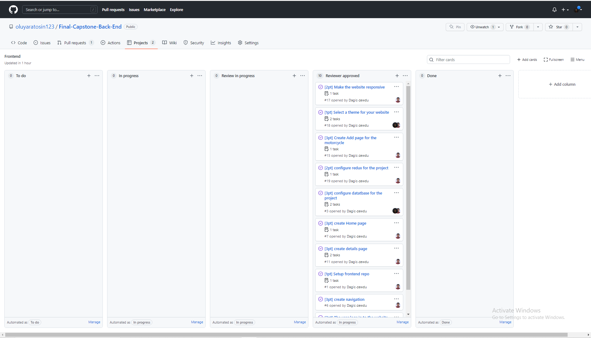

# Bcycom Back End
> This is the backend for the [Bcycom](http://sleepy-forest-22507.herokuapp.com/) web application and below is what you can following to set up this web application...

### Deployment

[Base url](http://sleepy-forest-22507.herokuapp.com/)

## Bcycom Front End

[Front End Repo](https://github.com/Dagic-zewdu/final-capstone-frontend)

## Built With

- Rails
- Ruby 
- Postgresql
- JWT
- Heroku

## Getting Started

Here are the steps to follow in order to get this project on your local computer.

### Kanban Board Final View
- Back End
    - 

- Front End
    - 
### Prerequisites

`rails, '~> 7.0.3' +`

`ruby '3.1.2' +`

### API Documentation
- Login Page
    - **POST**: http://localhost:3000/api/v1/login
    - **BASE URL**: http://sleepy-forest-22507.herokuapp.com/api/v1/login

- View All Users
    - **GET**: http://localhost:3000/api/v1/users
    - **BASE URL**: http://sleepy-forest-22507.herokuapp.com/api/v1/users

- Create Motorcycle Page this needs authorized token in the header. So you get token from the `/login` api
    - **POST**: http://localhost:3000/api/v1/motorcycle
    - **BASE URL**: http://sleepy-forest-22507.herokuapp.com/api/v1/motorcycle
    - **PUT** http:http://localhost:3000/api/v1/motorcycle/:id. This updates motorcyle with the given id. Be sure that you are the creator of this item. Which will be checked through the token you provide on the header.
    - **BASE URL**: http://sleepy-forest-22507.herokuapp.com/api/v1/motorcycle/:id
    - **Delete** http:http://localhost:3000/api/v1/motorcycle/:id. This deletes motorcyle with the given id. Be sure that you are the creator of this item. Which will be checked through the token you provide on the header.
    - **BASE URL**: http://sleepy-forest-22507.herokuapp.com/api/v1/motorcycle/:id
    
- View All Motorcycles
    - **GET**: http://localhost:3000/api/v1/motorcycles
    - **BASE URL**: http://sleepy-forest-22507.herokuapp.com/api/v1/motorcycles

- Motorcycle Details
    - **GET**: http://localhost:3000/api/v1/motorcycle/:id
    - **BASE URL**: http://sleepy-forest-22507.herokuapp.com/api/v1/motorcycle/1

- View All Reservations
    - **GET**: http://localhost:3000/api/v1/reservations
    - **BASE URL**: http://sleepy-forest-22507.herokuapp.com/api/v1/reservations

- Create reservation
    - **POST**: http://localhost:3000/api/v1/reservation
    - **BASE URL**: http://sleepy-forest-22507.herokuapp.com/api/v1/reservation

- Reservation Datails Page
    - **GET**: http://localhost:3000/api/v1/reservation/:id
    - **BASE URL**: http://sleepy-forest-22507.herokuapp.com/api/v1/reservation/1
    
### Setup

clone this repo by typing `git clone git@github.com:oluyaratosin123/Final-Capstone-Back-End.git`

### Install

install the dependencies by typing `bundle install`

### Usage

start the local server by running `rails s`

## Author

👤 **Dagic Zewdu**

- GitHub: [@Dagic-zewdu](https://github.com/Dagic-zewdu)
- Twitter: [@dagic4](https://twitter.com/dagic4)
- LinkedIn: [LinkedIn](https://www.linkedin.com/in/dagic-zewdu/)

👤 **Edward Oluyara**

- GitHub: [@oluyaratosin123](https://github.com/oluyaratosin123)
- Twitter: [@TOluyara](https://twitter.com/TOluyara)
- LinkedIn: [LinkedIn](https://www.linkedin.com/in/edward-oluyara/)

## 🤝 Contributing

Contributions, issues and feature requests are welcome!

Feel free to check the [issues page](issues/).

## Show your support

Give a ⭐️ if you like this project!

## Acknowledgments

 N/A

## 📝 License

This project is [MIT](lic.url) licensed.
